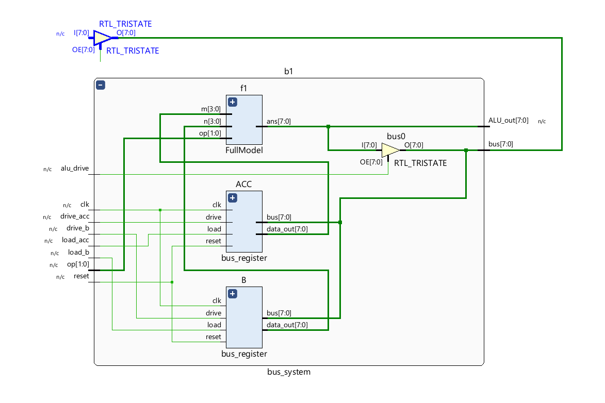
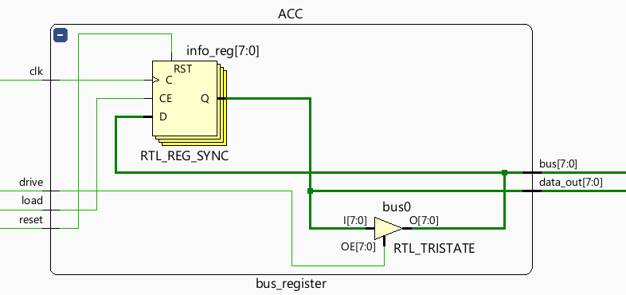
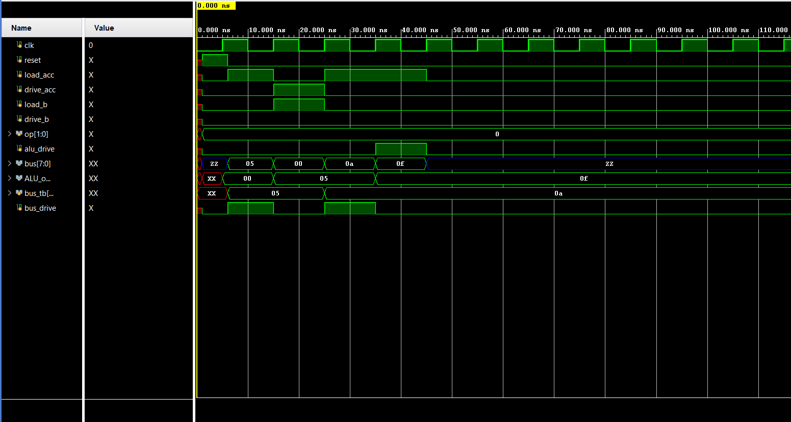

# 2-Register-Bus-System
A shared tri-state bus architecture connecting two general-purpose registers (ACC, B) to an ALU, implemented and verified in Verilog using AMD Xilinx Vivado.

## Key design decision:
 The ALU does not read its operands from the shared bus. Each register has a second, always-live output wire feeding the ALU directly -
the bus is reserved purely for moving values between registers and storing ALU results back into a register. This mirrors how real CPU datapaths separate the data-movement bus from the ALU's operand inputs.

## Modules Layout

| File Name | Component Type | Description |
| :--- | :--- | :--- |
| **`bus_register.v`** | Sub-module | Reusable register with synchronous load, tri-state drive, and a permanent direct output wire (`data_out`). |
| **`bus_system.v`** | Top-Level Wrapper | Connects the entire subsystem by instantiating the `ACC` (Accumulator), `B` register, and the ALU (`FullModel`), wiring them to a shared bus. |
| **`bus_system_tb.v`** | Testbench | Verification environment exercising load, drive, ALU computation, and result write-back sequences across the shared bus. |

---

## Operations Verified

| Test Phase | Action Taken | Verified Hardware Behavior |
| :--- | :--- | :--- |
| **Reset** | `reset` pulsed high for 1 clock cycle. | `ACC` and `B` registers both cleanly initialize to `0` (ensuring no `X` propagation). |
| **Load via Bus** | Testbench drives the bus line directly; sets `load_acc = 1`. | `ACC` successfully captures the external value from the bus. |
| **Register-to-Register** | `ACC` drives the bus line (`drive_acc = 1`); sets `load_b = 1`. | `B` register successfully captures `ACC`'s value over the shared data highway. |
| **ALU Compute** | `ACC` and `B` feed the ALU via direct structural wires. | Combinational execution path: ALU output reflects ($ACC + B$) at all times without waiting for a clock cycle. |
| **Write-back** | Sets `alu_drive = 1` and `load_acc = 1`. | The ALU's computation result is routed back onto the shared bus and safely captured back into `ACC`. |
| **Idle** | All driver control signals (`drive_acc`, `drive_b`, `alu_drive`, `bus_drive`) released. | Shared bus correctly floats to a clean high-impedance state (`Z`), confirming proper tri-state isolation layout. |

## Schematic :

## Simualtion Waveform :

